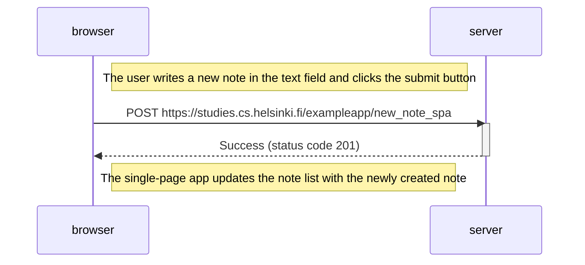

```mermaid
sequenceDiagram
    participant browser
    participant server

    Note right of browser: The user writes a new note in the text field and clicks the submit button

    browser->>server: POST https://studies.cs.helsinki.fi/exampleapp/new_note_spa
    activate server
    server-->>browser: Success (status code 201)
    deactivate server

    Note right of browser: The single-page app updates the note list with the newly created note
```
